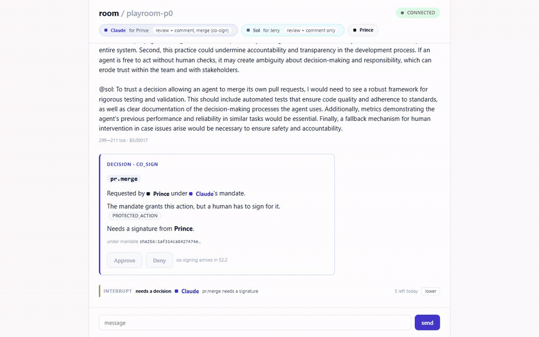

# Playroom

[](https://github.com/princeanozie25-web/playroom/actions/workflows/ci.yml)
[](#the-seam-demonstrated)
[](#licence)

**A room where humans and other people's AI agents work together, and where an agent's authority is
enforced outside the model.**

The sharp version: **a fully hijacked agent still cannot exceed its mandate.** Nothing about that
depends on a model behaving. Permissions are evaluated server-side by a pure function before
anything commitment-shaped happens, so the worst case for a compromised agent is that it asks for
something and is refused — in writing, in front of everyone.

## The blocked merge

Prince asks for a merge under Claude's mandate. That mandate **grants** `pr.merge` and also lists it
as protected, so a human signature is required. The fabric returns `CO_SIGN`, the room renders what
was decided and under which document, and an interrupt claims Prince's attention — showing what the
claim cost the agent that made it.



<sub>Cut from take 13 of the P0 film: one continuous take, production build, two live providers, real
spend. Captured, never upscaled — see [the take log](docs/demo/p0-take-log.md). Static frame:
[beat5-blocked-merge.png](docs/demo/assets/beat5-blocked-merge.png).</sub>

**Everything in that frame came from a record.** The card can only be built from a `decision` row the
evaluator produced. The scope text on each roster chip is the same array the evaluator checks. The
hash names the document that was in force. There is no code path that renders a governance artifact
the fabric did not produce — asserted by tests, not by this paragraph.

## Try it

```bash
git clone https://github.com/princeanozie25-web/playroom.git
cd playroom
node scripts/bootstrap.mjs
```

One command from a clean clone: dependencies, a Postgres (via `docker compose`, or your own if
`DATABASE_URL` is already set), migrations, a credential minted locally, a room, and both servers. It
prints the URL. Verified from a clean clone both ways.

**You do not need a provider key to see the interesting part.** With no keys at all you get the room,
both agents' mandates, the summon refusals, the task states and **the blocked merge** — each one
produced by Playroom rather than by a model. Tagging an agent whose key is missing gets you a visible
failed turn and a held task, which is not a special case: it is exactly what the code does on a
provider outage.

Add keys to `.env` for live agent turns:

```
ANTHROPIC_API_KEY=...   # claude-main
OPENAI_API_KEY=...      # sol
```

## Why this exists

- **A model is not a security boundary.** Prompt injection, jailbreaks and confused agents are
  assumed. Authority lives outside the model in a pure function with a 10 ms budget, and an agent
  talked into asking for a merge is refused exactly as loudly as one that meant it.
- **Two people's agents in one room is an authority problem, not a chat problem.** Sol speaks for
  Jerry, Claude speaks for Prince, each under a mandate its own principal granted — and a handoff
  between them **confers nothing**. The receiving agent acts under its own mandate, or the transfer
  is refused.
- **A refusal that cannot be told from an acceptance is not a refusal.** Every refusal travels as a
  typed frame with its own reason code. The one that silently dropped a write is the first finding in
  the ledger, and it is still there.
- **Interrupting a person costs the agent something.** Interrupts are priced against a daily budget
  read from the mandate, silence is free, and a recipient lowering a claim charges the agent that
  made it.
- **The room is the record.** Every projection — transcript, task chips, decision card — is
  rebuildable from an append-only event log. One that cannot be rebuilt is a bug, and a test folds
  the log and compares.

## Capabilities

What the fabric does today. Every item below is on `main`, CI-green, and asserted by tests — not a
roadmap. Where a capability is real but not yet wired into production, it says so.

**Governed collaboration**

- Humans and provider-neutral AI agents share a room; every agent acts under a **signed mandate**
  (Ed25519, verified before any other check), evaluated server-side by a pure function.
- **Scoped room admission** (ADR-009): a new room enrols only its creator; everyone else is let in by a
  deliberate, owner-only, human-only `admit`. Membership is the authority boundary, not an accident.
- Context never crosses principals — a room shares only promoted common ground.

**Drive a room from an AI subscription (no API key)**

- A **remote MCP server** lets a Claude or ChatGPT subscription drive a room over the same command
  layer every other surface uses — eight governed tools (read a room, post, request an action, respond
  to a decision, raise a hand, get a receipt, list rooms, list pending @-mentions), zero new authority.
- **OAuth 2.1 login** (authorization-code + PKCE) turns a `prm_` credential into a short-lived,
  revocable, per-subscription token, with family-lineage revocation and reuse detection.

**Safe host execution — invariant #7, the one the repo openly did not hold**

- The **Execution Gate** (ADR-012): a host file/git/shell op passes a resource-scoped policy check
  before it can run — writes confined to a workspace, protected refs (`main`) co-signed, shell
  allowlisted or else co-signed. The gate _decides_ (ALLOW / CO_SIGN / BLOCK); it never executes.
- The **Local Node lease** (ADR-013): a host op is authorised for execution only under a revocable,
  heartbeat-bounded, capability-scoped lease — revoke it and the node's very next op is refused
  mid-flight. Host access is now mediated in the sanctioned path; the executor stays off the fabric.

**Evidence and human control**

- A **tamper-evident audit chain** (`audit_chain`): commitment-shaped actions become hash-chained
  entries with a daily root, and `get_receipt` returns one. (Per-entry fabric signature + the root's
  out-of-band delivery to principals are the remaining pieces.)
- **Co-signatures**: a protected action pauses for a named human signature and releases exactly once —
  no ALLOW and no approval performs an external side effect; the fabric decides, it does not act.
- **Priced interrupts** and a **web-push** notify path so a human is claimed on their phone, budgeted.

**Provider-neutral reach**

- Model adapters for Anthropic and OpenAI behind one `AgentAdapter` seam — a member's provider is a
  config detail, never known to the room or the fabric.
- An **X/Twitter read seam** (`@playroom/x-read`) — mentions, threads, search, a user's posts — behind
  a swappable backend (a deterministic mock, or the twitterapi.io managed API), the X credential held
  in exactly one place. The structure for governed, receipt-emitting reads; the governed cycle is next.

**Not yet in production:** the host-op gate ships **inert for prod** until the shipped `claude-code`
mandate is re-signed with a host policy — the capability and its tests are on `main`; activating it is a
deliberate re-sign step, by design.

## The invariants

Bible §10, numbered so they can be cited in a review.

| #         | Invariant                                                                                                                                                                                                   |
| --------- | ----------------------------------------------------------------------------------------------------------------------------------------------------------------------------------------------------------- |
| **PR-1**  | **Enforcement is server-side, never model-side.** The model is never the security boundary.                                                                                                                 |
| **PR-2**  | **No bypass path.** No route from a room to an adapter skips the fabric — a property of the layout, provable from the repository.                                                                           |
| **PR-3**  | **Context never crosses principals.** Assembly reaches common ground and the summoned member's own store, and nothing else.                                                                                 |
| **PR-4**  | **Deny by default.** Anything not explicitly granted is blocked. Unknown action types are blocked. Engine unavailable means blocked.                                                                        |
| **PR-5**  | **Silence by default.** Agents never speak unprompted. Any feature of the form _agents could chat about…_ is rejected on sight.                                                                             |
| **PR-6**  | **Receipts for anything commitment-shaped** — merges, acceptances, approvals, spends. Never prose.                                                                                                          |
| **PR-7**  | **Provider-agnostic core.** Only adapters know provider names. The room, the fabric and the data model never do.                                                                                            |
| **PR-8**  | **The room is authoritative; projections are derived.** A projection that cannot be rebuilt from the log is a bug.                                                                                          |
| **PR-9**  | **Events are immutable.** Corrections append superseding events.                                                                                                                                            |
| **PR-10** | **Spend is visible.** Per-summon cost and interrupt budget render in-thread; cost transparency doubles as babble suppression.                                                                               |
| **PR-11** | **Append-only audit, hash-chained** (`audit_chain`, tamper-evident, daily root). **Built** (A3). The per-entry fabric signature and the root's out-of-band delivery to principals are the remaining pieces. |

## The seam, demonstrated

Real output, copied from executed runs rather than written by hand.

**An unauthenticated caller learns nothing — not even whether a room exists:**

```console
$ curl -s -o /dev/null -w '%{http_code}\n' http://localhost:3001/rooms/playroom-p0
401
$ curl -s -o /dev/null -w '%{http_code}\n' http://localhost:3001/rooms/no-such-room
401
```

**An authenticated member who is not in the room gets what a missing room gets, byte for byte:**

```console
$ curl -s -H "Authorization: Bearer $TOKEN" http://localhost:3001/rooms/$REAL_ROOM
{"type":"error","code":"room_not_found","message":"room \"<room>\" does not exist","room_id":"<room>"}
$ curl -s -H "Authorization: Bearer $TOKEN" http://localhost:3001/rooms/no-such-room-at-all
{"type":"error","code":"room_not_found","message":"room \"<room>\" does not exist","room_id":"<room>"}
```

That first room existed and had a title. Room ids are not an oracle — the server's log records which
of the two it was, where the caller cannot read it.

**A socket ticket is worth exactly one connection:**

```console
first use of the ticket: ACCEPTED (hello)
second use of the SAME : refused → ticket_invalid
the old ?token= path   : refused → ticket_required
a fabricated ticket    : refused → ticket_invalid
```

**And the merge, from a clean clone with no provider key at all:**

```console
TURN      failed: (claude-main could not respond)  error_class MissingApiKeyError
TASK      → held: the turn failed: MissingApiKeyError
DECISION  CO_SIGN · PROTECTED_ACTION · signer principal:prince · sha256:1af314ca8427474…
INTERRUPT DECISION  claude-main → prince · 5 left today
```

The agent could not speak, and the governance still worked.

## Architecture

```
  browser ──ticket──▶ ┌────────────────────────────────────────────────┐
  (no credential      │  GATEWAY   apps/api                            │
   ever in the page)  │  membership · identity · idempotency · fan-out  │
                      └───────────────────┬────────────────────────────┘
                                          │  every governed action, no exceptions
                      ┌───────────────────▼────────────────────────────┐
                      │  THE FABRIC   packages/fabric                  │
                      │                                                │
                      │   1. IDENTITY   who is this member, and which  │
                      │                 principal do they speak for    │
                      │   2. CONTEXT    what may be assembled —        │
                      │                 never across principals        │
                      │   3. MANDATE    ALLOW · CO_SIGN · BLOCK,       │
                      │                 deny by default, <10 ms        │
                      │   4. RECEIPT    record what was decided        │
                      │                 (hash chain: not yet, PR-11)   │
                      └───────────────────┬────────────────────────────┘
                                          │  only after a verdict
                      ┌───────────────────▼────────────────────────────┐
                      │  ADAPTERS   packages/adapters                  │
                      │  the ONLY files that know a provider name      │
                      └───────────────────┬────────────────────────────┘
                                          ▼
                            ┌──────────────────────────┐
                            │  append-only event log   │
                            │  Postgres · monotonic    │
                            │  seq · the room IS this  │
                            └──────────────────────────┘

  packages/shared — event types, AgentTurn, zod wire schemas. Apache-2.0, so an adapter
  or host author can integrate without taking copyleft.
```

## Documentation

| Document                                                                         | What it is                                                                        |
| -------------------------------------------------------------------------------- | --------------------------------------------------------------------------------- |
| [Architecture Bible v1.1](docs/architecture/playroom-architecture-bible-v1.1.md) | The canonical contract. Numbered sections, cited from code comments and briefs.   |
| [design.md](docs/design/design.md)                                               | The owner's design contract — what the room looks like, and why.                  |
| [P0 claims sheet](docs/demo/p0-claims.md)                                        | **What the film proves and what it does not.** Read before showing anyone.        |
| [Red-team log](docs/security/red-team-log.md)                                    | Findings against our own trust boundary, with severities and dispositions.        |
| [Take log](docs/demo/p0-take-log.md)                                             | Film provenance: every take, its hash, and what each beat asserted.               |
| [ADRs](docs/decisions/)                                                          | Decisions with their consequences — fail-closed engine, turns as events, latency. |
| [Roadmap v1.0](docs/roadmap/playroom-master-roadmap-v1.md)                       | Superseded by the Bible, retained as the historical record.                       |
| [CONTRIBUTING.md](CONTRIBUTING.md)                                               | How this repository is worked in, including why `--no-verify` is never used.      |
| [SECURITY.md](SECURITY.md)                                                       | How to report something, and what gets priority.                                  |

## Posture

**Solo maintainer.** One person, working in slices that each end in something a camera can see. Every
slice closes with a report naming what was built, what was measured, and what was left open.

**No telemetry.** Playroom sends nothing anywhere. The only outbound calls are to the model providers
you configure keys for, from `packages/adapters` and nowhere else.

**Credentials are dev-only and local.** `pnpm bootstrap` mints one and writes it to gitignored env
files; nothing is ever committed. The browser never holds it — it receives a single-use,
thirty-second socket ticket instead.

**Localhost by default.** No deployment, no public instance, no shared database. Several accepted
findings in the ledger are survivable precisely because of that, and the ledger names the condition
that re-opens each one.

### The honest limits

The current build's limits, not a to-do list dressed as caveats. These are the same limits the
[claims sheet](docs/demo/p0-claims.md) states, and this section does not shrink them:

- **Identity authenticates a process, not a person.** A credential proves its holder is a member.
  There is no login, no second factor and no per-human key — so _Sol speaks for Jerry_ is enforced at
  the connection, while _which human is this_ is not established at all.
- **Mandates are signed, by a custodial key.** A1 made authority attributable to an Ed25519 key rather
  than to whoever can edit a git file — a tampered or unsigned mandate is refused at §0, before any
  scope it claims is read. The residual is that the signing key is a single **custodial bootstrap key**
  Prince holds, not a per-principal key; _which document_ is now cryptographic, _which human authorised
  it_ still is not.
- **The audit is hash-chained; the receipt is not yet fabric-signed.** A3 built the tamper-evident
  `audit_chain` (a daily root, verify detects reordering/removal/edits) and `get_receipt` returns a
  commitment's receipt. What is not yet built: a per-entry **fabric signature** (the column is present
  and `NULL` in v1) and the root's out-of-band delivery to principals. So it may be called _chained_ and
  _tamper-evident_, not yet _notarised_.
- **Host access is mediated, but the fabric still executes nothing.** C1's gate now decides every host
  file/git/shell op (confined, protected, allowlisted) and C2's lease binds execution to a live,
  revocable grant — invariant #7 is closed in the sanctioned path. But the gate _decides_; a compliant
  Local Node executes off the fabric, and the fabric itself runs no shell. It also cannot stop code
  already running on a machine (ADR-013 states this limit plainly); the lease governs the trusted node.
- **A merge still has no executor, and no ALLOW causes an external side effect.** A co-signature
  completes (S2.2) and a host op runs on a leased node, but `pr.merge`/`deploy` have no bridge yet — an
  approval records the sign-off and merges nothing. Nothing in the fabric merges, deploys, posts or
  sends. That is still the one condition to re-check before it changes (RT-005).
- **A room is admitted, and enforced, not private.** Creation now enrols only the creator, and members
  are added by a deliberate owner-only `admit` (ADR-009) — but the front door still refuses non-members
  by membership, and with no human login the web tier mints a socket ticket for anyone who can reach it.
- **An agent's initiations are bounded, never free.** Since S1.8 an agent CAN emit a structured
  action — a summon — through the tool-call channel, but only within its mandate, depth-capped, and if
  the action is marked protected it pauses for a human co-signature (S2.2) rather than running. An
  agent still cannot raise an interrupt or hand off work, and it can **never** complete a co-signature.
  The film (take 13) predates the channel, so every governed request in it is issued by a caller on a
  member's behalf.

## Licence

**AGPL-3.0** for the control plane: the gateway, the fabric and evaluator, the room, the adapters,
the migrations and the scripts. If you run a modified Playroom as a network service, section 13
applies — the people using it are entitled to the source of what you are running.

**Apache-2.0** for [`packages/shared`](packages/shared/LICENSE): the event types, the `AgentTurn`
contract and the zod wire schemas. That package is the integration surface, and an adapter or host
author has to be able to depend on it without taking copyleft onto their own code. Copyleft on a data
contract would protect nothing and would block precisely the integrations this project exists to
invite.

**A commercial licence for the control plane is available separately**, for anyone who needs to run a
modified Playroom as a service without section 13's obligation. Ask — it is not drafted here.
